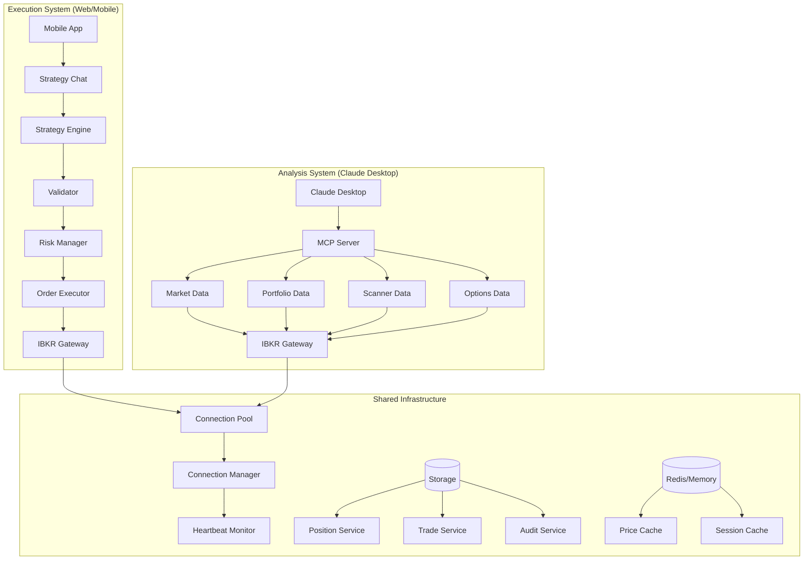
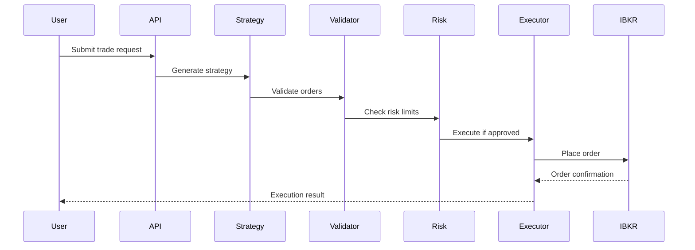
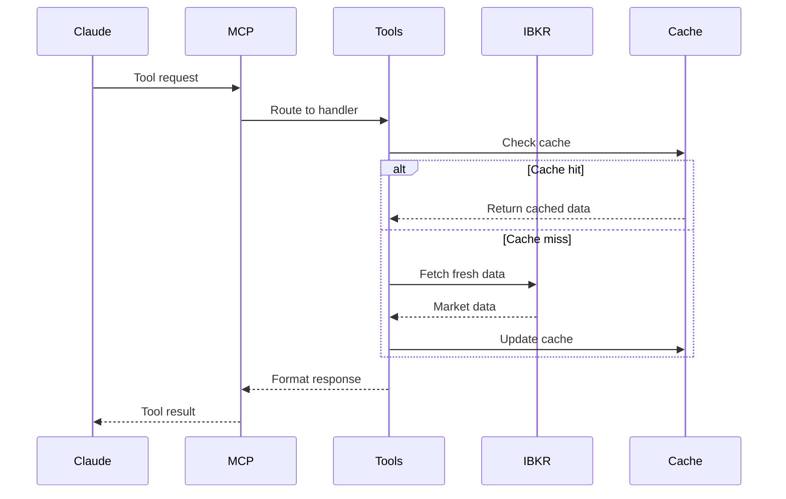

# Gallump Next Generation - Modular Trading System Architecture

## Core Design Principles
1. **Single Responsibility**: Each module does ONE thing
2. **Type Safety**: Everything typed with Python type hints
3. **IBKR Best Practices**: Based on ib_insync patterns
4. **Clean Separation**: Execution vs Analysis completely separate
5. **Testable**: Each module independently testable

## System Architecture



## Module Structure

```
gallump_next/
├── core/
│   ├── types.py              # ALL type definitions
│   ├── connection_manager.py  # Manages IBKR connections
│   ├── connection_pool.py     # Connection pooling
│   └── heartbeat_monitor.py   # Keeps connections alive
├── market_data/
│   ├── price_fetcher.py      # Gets current prices
│   ├── historical_data.py     # Gets historical bars
│   ├── market_depth.py        # Level 2 data
│   └── tick_streamer.py       # Real-time ticks
├── portfolio/
│   ├── position_tracker.py    # Track positions
│   ├── pnl_calculator.py      # Calculate P&L
│   ├── account_monitor.py     # Monitor account values
│   └── order_tracker.py       # Track open orders
├── execution/
│   ├── order_builder.py       # Build order objects
│   ├── order_validator.py     # Validate orders
│   ├── risk_checker.py        # Check risk limits
│   └── order_executor.py      # Execute orders
├── strategy/
│   ├── strategy_generator.py  # Generate strategies with AI
│   ├── strategy_parser.py     # Parse AI responses
│   ├── strategy_validator.py  # Validate strategies
│   └── strategy_executor.py   # Execute strategies
├── mcp_server/
│   ├── mcp_server.py          # Main MCP server
│   ├── tool_registry.py       # Register all tools
│   ├── tool_handlers.py       # Handle tool calls
│   └── response_formatter.py  # Format responses
├── storage/
│   ├── trade_logger.py        # Log all trades
│   ├── position_store.py      # Store positions
│   ├── audit_logger.py        # Audit trail
│   └── database_manager.py    # Manage DB connections
├── cache/
│   ├── price_cache.py         # Cache prices
│   ├── session_cache.py       # Cache sessions
│   └── cache_manager.py       # Manage cache
└── api/
    ├── execution_api.py       # Trading endpoints
    ├── analytics_api.py       # Analysis endpoints
    └── health_api.py          # Health checks
```

## Complete Type Definitions

```python
# types.py - Single source of truth for all types
from dataclasses import dataclass
from typing import Optional, List, Dict, Any, Union, Literal
from datetime import datetime
from decimal import Decimal
from enum import Enum

# Enums
class OrderAction(Enum):
    BUY = "BUY"
    SELL = "SELL"

class OrderType(Enum):
    MARKET = "MKT"
    LIMIT = "LMT"
    STOP = "STP"
    STOP_LIMIT = "STP LMT"
    TRAILING_STOP = "TRAIL"

class OrderStatus(Enum):
    PENDING_SUBMIT = "PendingSubmit"
    SUBMITTED = "Submitted"
    FILLED = "Filled"
    CANCELLED = "Cancelled"
    ERROR = "Error"

class TimeInForce(Enum):
    DAY = "DAY"
    GTC = "GTC"
    IOC = "IOC"
    FOK = "FOK"

class AssetType(Enum):
    STOCK = "STK"
    OPTION = "OPT"
    FUTURE = "FUT"
    FOREX = "CASH"
    CRYPTO = "CRYPTO"

# Data Classes
@dataclass
class Position:
    symbol: str
    quantity: Decimal
    average_cost: Decimal
    current_price: Decimal
    market_value: Decimal
    unrealized_pnl: Decimal
    realized_pnl: Decimal
    asset_type: AssetType
    account: str
    contract_id: int

@dataclass
class Order:
    symbol: str
    action: OrderAction
    quantity: Decimal
    order_type: OrderType
    limit_price: Optional[Decimal] = None
    stop_price: Optional[Decimal] = None
    trail_amount: Optional[Decimal] = None
    trail_percent: Optional[Decimal] = None
    time_in_force: TimeInForce = TimeInForce.DAY
    asset_type: AssetType = AssetType.STOCK
    
@dataclass
class Execution:
    order_id: str
    symbol: str
    action: OrderAction
    quantity: Decimal
    price: Decimal
    commission: Decimal
    timestamp: datetime
    exchange: str

@dataclass
class MarketData:
    symbol: str
    bid: Decimal
    ask: Decimal
    last: Decimal
    volume: int
    bid_size: int
    ask_size: int
    timestamp: datetime
    is_halted: bool
    is_snapshot: bool

@dataclass
class Account:
    account_id: str
    net_liquidation: Decimal
    buying_power: Decimal
    cash: Decimal
    maintenance_margin: Decimal
    excess_liquidity: Decimal
    cushion: Decimal

@dataclass
class Strategy:
    name: str
    reasoning: str
    risk_level: Literal["conservative", "moderate", "aggressive"]
    confidence: float
    orders: List[Order]
    max_loss: Optional[Decimal] = None
    max_gain: Optional[Decimal] = None
    
@dataclass
class RiskCheck:
    approved: bool
    warnings: List[str]
    position_size_ok: bool
    buying_power_ok: bool
    daily_loss_ok: bool
    concentration_ok: bool
```

## Connection Management (IBKR Best Practices)

```python
# connection_manager.py
import asyncio
from typing import Optional, Dict, Any
from ib_insync import IB, util
import logging

class ConnectionManager:
    """Manages a single IBKR connection with automatic reconnection"""
    
    def __init__(self, host: str = "127.0.0.1", port: int = 4001):
        self.host = host
        self.port = port
        self.ib: Optional[IB] = None
        self.client_id: int = self._get_next_client_id()
        self.reconnect_attempts = 0
        self.max_reconnects = 5
        
    async def connect(self) -> bool:
        """Establish connection with retry logic"""
        try:
            self.ib = IB()
            await self.ib.connectAsync(
                self.host, 
                self.port, 
                clientId=self.client_id
            )
            self.ib.errorEvent += self._on_error
            self.ib.disconnectedEvent += self._on_disconnect
            self._start_heartbeat()
            logging.info(f"Connected to IBKR: {self.host}:{self.port}")
            return True
        except Exception as e:
            logging.error(f"Connection failed: {e}")
            return await self._reconnect()
    
    async def _reconnect(self) -> bool:
        """Reconnect with exponential backoff"""
        if self.reconnect_attempts >= self.max_reconnects:
            return False
        
        wait_time = 2 ** self.reconnect_attempts
        await asyncio.sleep(wait_time)
        self.reconnect_attempts += 1
        self.client_id = self._get_next_client_id()
        return await self.connect()
```

## Module Examples

### 1. Price Fetcher (Single Responsibility)
```python
# market_data/price_fetcher.py
from typing import Dict, List
from decimal import Decimal
from gallump_next.core.types import MarketData
from gallump_next.core.connection_pool import ConnectionPool

class PriceFetcher:
    """Fetches current prices - ONE job only"""
    
    def __init__(self, connection_pool: ConnectionPool):
        self.pool = connection_pool
        
    async def get_price(self, symbol: str) -> MarketData:
        """Get single symbol price"""
        conn = await self.pool.get_connection()
        try:
            contract = Stock(symbol, 'SMART', 'USD')
            ticker = await conn.ib.reqTickerAsync(contract)
            return self._ticker_to_market_data(ticker)
        finally:
            await self.pool.release_connection(conn)
    
    async def get_prices(self, symbols: List[str]) -> Dict[str, MarketData]:
        """Get multiple prices in parallel"""
        tasks = [self.get_price(symbol) for symbol in symbols]
        results = await asyncio.gather(*tasks)
        return dict(zip(symbols, results))
```

### 2. Order Validator (Single Responsibility)
```python
# execution/order_validator.py
from gallump_next.core.types import Order, OrderType
from typing import List, Tuple

class OrderValidator:
    """Validates orders - ONE job only"""
    
    def validate(self, order: Order) -> Tuple[bool, List[str]]:
        """Validate a single order"""
        errors = []
        
        # Check quantity
        if order.quantity <= 0:
            errors.append("Quantity must be positive")
        
        # Check limit price for limit orders
        if order.order_type == OrderType.LIMIT:
            if not order.limit_price or order.limit_price <= 0:
                errors.append("Limit orders require valid limit price")
        
        # Check stop price for stop orders
        if order.order_type in [OrderType.STOP, OrderType.STOP_LIMIT]:
            if not order.stop_price or order.stop_price <= 0:
                errors.append("Stop orders require valid stop price")
        
        # Check trailing stop
        if order.order_type == OrderType.TRAILING_STOP:
            if not order.trail_amount and not order.trail_percent:
                errors.append("Trailing stop requires amount or percent")
        
        return len(errors) == 0, errors
```

### 3. MCP Tool Handler (For Claude Desktop)
```python
# mcp_server/tool_handlers.py
from typing import Dict, Any
from gallump_next.market_data.price_fetcher import PriceFetcher
from gallump_next.portfolio.position_tracker import PositionTracker

class MCPToolHandlers:
    """Handles MCP tool calls from Claude Desktop"""
    
    def __init__(self, price_fetcher: PriceFetcher, position_tracker: PositionTracker):
        self.price_fetcher = price_fetcher
        self.position_tracker = position_tracker
        
    async def handle_get_quote(self, params: Dict[str, Any]) -> Dict[str, Any]:
        """Handle get_quote tool call"""
        symbol = params.get("symbol")
        market_data = await self.price_fetcher.get_price(symbol)
        return {
            "symbol": symbol,
            "bid": str(market_data.bid),
            "ask": str(market_data.ask),
            "last": str(market_data.last),
            "volume": market_data.volume
        }
    
    async def handle_get_positions(self, params: Dict[str, Any]) -> Dict[str, Any]:
        """Handle get_positions tool call"""
        positions = await self.position_tracker.get_all_positions()
        return {
            "positions": [
                {
                    "symbol": p.symbol,
                    "quantity": str(p.quantity),
                    "pnl": str(p.unrealized_pnl)
                }
                for p in positions
            ]
        }
```

## Data Flow Diagrams

### Execution Flow


### MCP Analysis Flow


## Configuration Files

### pyproject.toml
```toml
[project]
name = "gallump-next"
version = "2.0.0"
dependencies = [
    "ib_insync>=0.9.86",
    "anthropic>=0.7.0",
    "fastapi>=0.104.0",
    "uvicorn>=0.24.0",
    "redis>=5.0.0",
    "sqlalchemy>=2.0.0",
    "pydantic>=2.5.0",
]

[project.optional-dependencies]
dev = [
    "pytest>=7.4.0",
    "pytest-asyncio>=0.21.0",
    "black>=23.0.0",
    "mypy>=1.7.0",
    "ruff>=0.1.0",
]
```

### config.yaml
```yaml
# Configuration for all environments
ibkr:
  host: 127.0.0.1
  live_port: 4001
  paper_port: 4002
  max_connections: 3
  reconnect_attempts: 5
  heartbeat_interval: 30

market_data:
  cache_ttl: 5  # seconds
  batch_size: 50
  timeout: 10

execution:
  max_position_size: 10000
  max_daily_loss: 5000
  require_confirmation: true
  
mcp:
  server_name: "ibkr-trading"
  version: "1.0.0"
  max_context_length: 100000
  
storage:
  database_url: "sqlite:///gallump.db"
  backup_interval: 3600
  
cache:
  redis_url: "redis://localhost:6379"
  fallback_to_memory: true
```