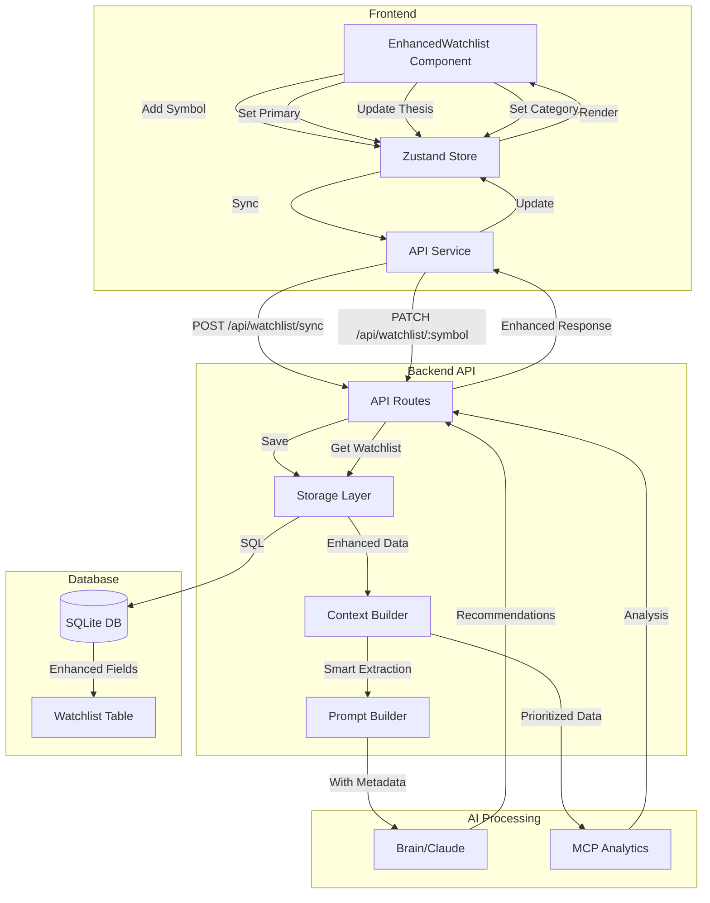
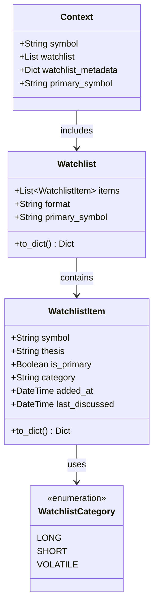
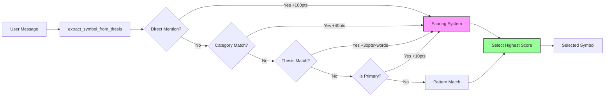
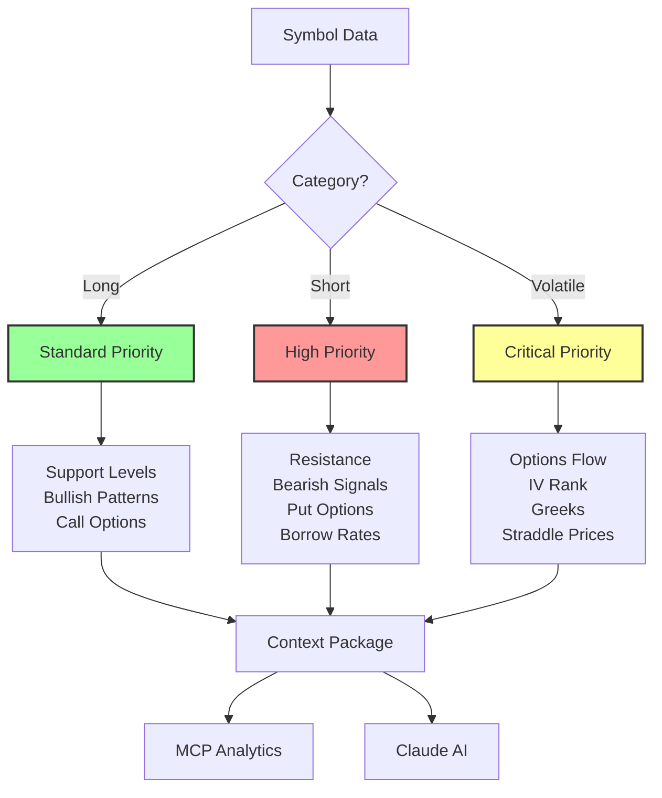
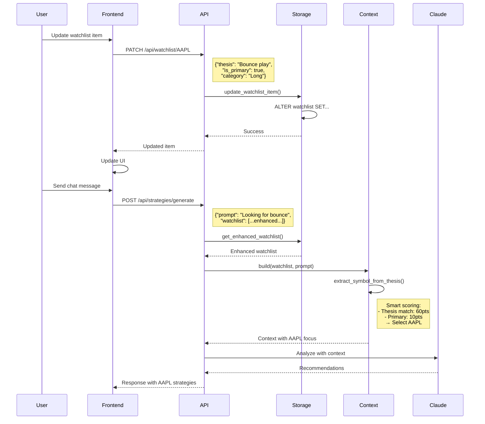
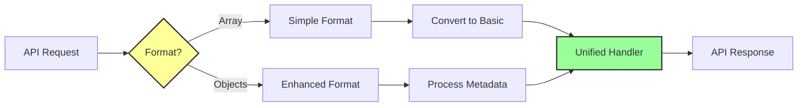

# Enhanced Watchlist System Architecture

## Data Flow Diagram

## Enhanced Watchlist Data Structure

## Smart Symbol Extraction Flow

## Category-Based Prioritization

## API Endpoint Flow

## Backward Compatibility

