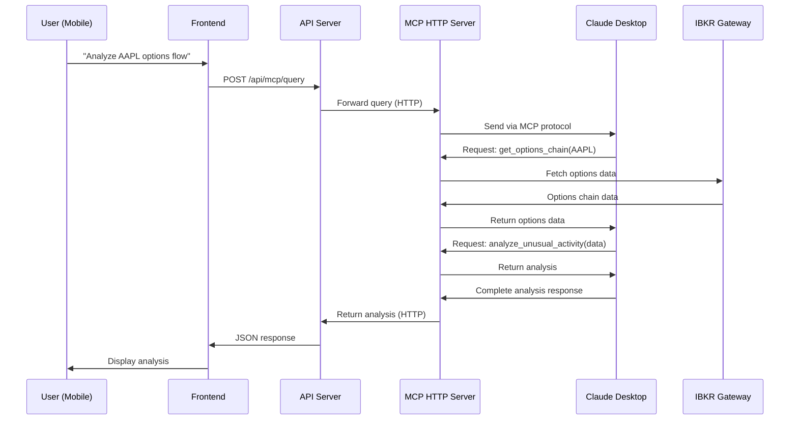
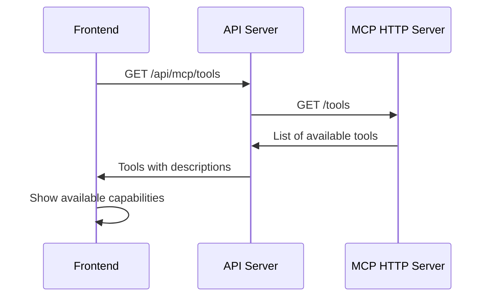

# MCP HTTP Architecture for Remote Claude Desktop Integration

## Executive Summary

This document defines the architecture for enabling remote access to Claude Desktop's MCP capabilities from the Gallump mobile interface. The goal is to allow users to leverage Claude Desktop's sophisticated analysis capabilities with live IBKR data while away from their home computer.

## Problem Statement

- **User Need**: Access Claude Desktop's powerful analysis with IBKR data from mobile phone
- **Current Limitation**: MCP servers typically use stdio (local only)
- **Solution**: HTTP-based MCP server with proper proxy architecture

## Core Principles

1. **Clear Separation**: Claude Desktop analysis is COMPLETELY separate from Strategy Chat
2. **No Execution**: Claude Desktop tab is READ-ONLY analysis, no trading
3. **No Confusion**: Different UI, different endpoints, different purpose
4. **Cost Effective**: Uses Claude Desktop (free) not API tokens
5. **Full Context**: Claude Desktop manages its own memory and context

## Architecture Overview

```
┌─────────────────────────────────────────────────────────────┐
│                     Mobile Phone (Remote)                    │
│  ┌─────────────────────────────────────────────────────┐   │
│  │                 Gallump Frontend                     │   │
│  │  ┌──────────────┐  ┌──────────────┐  ┌──────────┐  │   │
│  │  │Strategy Chat │  │Claude Desktop│  │Portfolio  │  │   │
│  │  │   (Trade)    │  │  (Analyze)   │  │  (View)   │  │   │
│  │  └──────────────┘  └──────────────┘  └──────────┘  │   │
│  └─────────────────────────────────────────────────────┘   │
└─────────────────────────────────────────────────────────────┘
                              │
                     Internet (HTTPS)
                              │
┌─────────────────────────────────────────────────────────────┐
│                    Home Server (Local)                       │
│                                                              │
│  ┌─────────────────────────────────────────────────────┐   │
│  │          Gallump API Server (Port 5001)             │   │
│  │  ┌──────────────┐  ┌──────────────┐               │   │
│  │  │Strategy API  │  │ MCP Proxy   │               │   │
│  │  │/api/strategies│  │/api/mcp/*   │               │   │
│  │  └──────────────┘  └──────────────┘               │   │
│  └─────────────────────────────────────────────────────┘   │
│                    │                    │                    │
│         Claude API │                    │ HTTP               │
│                    │                    │                    │
│  ┌─────────────────────────────────────────────────────┐   │
│  │       MCP HTTP Server (Port 5003)                   │   │
│  │                                                      │   │
│  │  Exposes MCP tools via HTTP for Claude Desktop     │   │
│  │  - get_quote, get_options_chain, analyze_flow      │   │
│  │  - get_positions, run_scanner, get_technicals      │   │
│  └─────────────────────────────────────────────────────┘   │
│                              │                               │
│                         stdio/MCP                            │
│                              │                               │
│  ┌─────────────────────────────────────────────────────┐   │
│  │           Claude Desktop Application                 │   │
│  │                                                      │   │
│  │  - Manages conversation context                     │   │
│  │  - Decides which tools to use                       │   │
│  │  - Provides intelligent analysis                    │   │
│  └─────────────────────────────────────────────────────┘   │
│                              │                               │
│  ┌─────────────────────────────────────────────────────┐   │
│  │              IBKR Gateway (Port 4001)               │   │
│  │                                                      │   │
│  │  - Live market data                                 │   │
│  │  - Options chains                                   │   │
│  │  - Account information                              │   │
│  └─────────────────────────────────────────────────────┘   │
└─────────────────────────────────────────────────────────────┘
```

## Component Definitions

### 1. Claude Desktop Tab (Frontend)
**Purpose**: Interface for Claude Desktop analysis
**Location**: `gallump/frontend/src/components/ClaudeDesktop/`
**Features**:
- Purple/indigo theme to differentiate from Strategy Chat
- Shows "Powered by Claude Desktop" prominently
- Displays MCP tool usage in real-time
- NO execution buttons, purely analysis

### 2. MCP Proxy Endpoints (API Server)
**Purpose**: Proxy requests between frontend and MCP HTTP Server
**Location**: `gallump/api/routes.py` (new endpoints)
**Endpoints**:
- `POST /api/mcp/query` - Send query to Claude Desktop
- `GET /api/mcp/status` - Check Claude Desktop connection
- `GET /api/mcp/tools` - List available MCP tools
- `GET /api/mcp/history` - Get analysis history

### 3. MCP HTTP Server
**Purpose**: Bridge between HTTP requests and Claude Desktop
**Location**: `mcp_http_server.py` (new file)
**Features**:
- Runs on port 5003
- Supports both stdio (local) and HTTP (remote) modes
- Manages Claude Desktop subprocess
- Provides all IBKR data tools

### 4. Claude Desktop Configuration
**Purpose**: Configure Claude Desktop to use our MCP server
**Location**: `claude_desktop_config.json`
```json
{
  "mcpServers": {
    "gallump-analytics": {
      "transport": "http",
      "url": "http://localhost:5003/mcp",
      "env": {
        "GALLUMP_DB_PATH": "/path/to/gallump/data/trading.db",
        "IBKR_HOST": "127.0.0.1",
        "IBKR_PORT": "4001"
      }
    }
  }
}
```

## Data Flow Sequences

### Sequence 1: User Query from Mobile



### Sequence 2: Tool Discovery



## MCP Tools Specification

### Market Data Tools
```typescript
interface MarketDataTools {
  get_quote(symbol: string): Quote;
  get_market_depth(symbol: string, levels: number): Level2Data;
  get_historical_bars(symbol: string, period: string): Bar[];
  get_trades(symbol: string, limit: number): Trade[];
}
```

### Options Tools
```typescript
interface OptionsTools {
  get_options_chain(symbol: string): OptionsChain;
  analyze_options_flow(symbol: string): UnusualActivity;
  calculate_strategies(legs: OptionLeg[]): StrategyAnalysis;
  get_greeks(contracts: string[]): Greeks[];
}
```

### Portfolio Tools
```typescript
interface PortfolioTools {
  get_positions(): Position[];
  get_account_summary(): AccountSummary;
  get_pnl(period: string): PnLReport;
  get_orders(status: string): Order[];
}
```

### Analysis Tools
```typescript
interface AnalysisTools {
  get_technicals(symbol: string): TechnicalIndicators;
  get_fundamentals(symbol: string): Fundamentals;
  get_news(symbol: string, sentiment: boolean): NewsItem[];
  run_scanner(scanType: string, filters: object): ScanResult[];
}
```

### Gallump-Specific Tools
```typescript
interface GallumpTools {
  get_annotations(type: string, symbol?: string): Annotation[];
  get_strategies(status: string): Strategy[];
  get_session_context(session_id: string): SessionContext;
}
```

## API Endpoints Detail

### POST /api/mcp/query
**Purpose**: Send analysis query to Claude Desktop
**Request**:
```json
{
  "query": "Analyze unusual options activity for AAPL",
  "context": {
    "symbols": ["AAPL"],
    "include_positions": true,
    "include_history": true
  }
}
```
**Response**:
```json
{
  "analysis": "Based on the options flow analysis...",
  "tools_used": ["get_options_chain", "analyze_options_flow"],
  "data_points": 47,
  "timestamp": "2024-01-15T10:30:00Z"
}
```

### GET /api/mcp/status
**Purpose**: Check MCP server and Claude Desktop status
**Response**:
```json
{
  "mcp_server": "running",
  "claude_desktop": "connected",
  "available_tools": 24,
  "ibkr_connection": "active",
  "last_query": "2024-01-15T10:30:00Z"
}
```

## Implementation Phases

### Phase 1: Foundation (Week 1)
1. Create MCP HTTP server with basic tools
2. Test with Claude Desktop locally
3. Verify IBKR data access

### Phase 2: Integration (Week 2)
1. Add MCP proxy endpoints to API server
2. Create Claude Desktop frontend tab
3. Implement basic query flow

### Phase 3: Enhancement (Week 3)
1. Add all MCP tools
2. Implement tool usage visualization
3. Add analysis history

### Phase 4: Polish (Week 4)
1. Error handling and recovery
2. Performance optimization
3. Documentation and testing

## Key Differences from Current System

| Aspect | Strategy Chat (Current) | Claude Desktop Tab (New) |
|--------|------------------------|--------------------------|
| AI Provider | Claude API | Claude Desktop App |
| Cost | ~$0.01-0.05 per query | FREE |
| Purpose | Trade Execution | Analysis Only |
| Context | Limited (token limit) | Unlimited (desktop app) |
| Memory | SessionManager | Claude Desktop built-in |
| Execution | RED BUTTON available | NO execution capability |
| Theme | Blue/Cyan | Purple/Indigo |
| Endpoint | /api/strategies/* | /api/mcp/* |
| Protocol | REST API | MCP over HTTP |

## Security Considerations

1. **Read-Only Access**: MCP server has NO execution capabilities
2. **Authentication**: All requests require JWT token
3. **Rate Limiting**: Prevent abuse of Claude Desktop
4. **Audit Logging**: Track all MCP queries
5. **Network**: Use HTTPS in production

## Testing Strategy

1. **Unit Tests**: Test each MCP tool independently
2. **Integration Tests**: Test full query flow
3. **Load Tests**: Ensure system handles multiple queries
4. **UI Tests**: Verify frontend correctly displays analysis

## Success Criteria

1. Users can query Claude Desktop from mobile phone
2. Clear visual distinction from Strategy Chat
3. No confusion about execution capabilities
4. Sub-2 second response time for queries
5. All IBKR data accessible via MCP tools

## Migration Path

1. No migration needed - this is additive
2. Existing Strategy Chat remains unchanged
3. Users opt-in to Claude Desktop tab
4. Can run both systems in parallel

## Rollback Plan

If issues arise:
1. Disable Claude Desktop tab in frontend
2. Stop MCP HTTP server
3. Remove /api/mcp/* endpoints
4. System continues working with Strategy Chat only

## FAQ

**Q: Why not just use Claude API for everything?**
A: Cost and context limits. Claude Desktop is free and has unlimited context.

**Q: Can this execute trades?**
A: NO. This is read-only analysis only. Trades go through Strategy Chat.

**Q: What if Claude Desktop is offline?**
A: The tab shows "Claude Desktop Disconnected" and suggests using Strategy Chat.

**Q: How is this different from the Analytics tab?**
A: Analytics tab was trying to use MCP modules directly. This uses actual Claude Desktop.

## Next Steps

1. Review and approve this architecture
2. Create detailed API specifications
3. Build MCP HTTP server
4. Implement frontend tab
5. Test end-to-end flow

---

**Document Status**: DRAFT - Awaiting Review
**Last Updated**: 2024-01-15
**Author**: System Architect